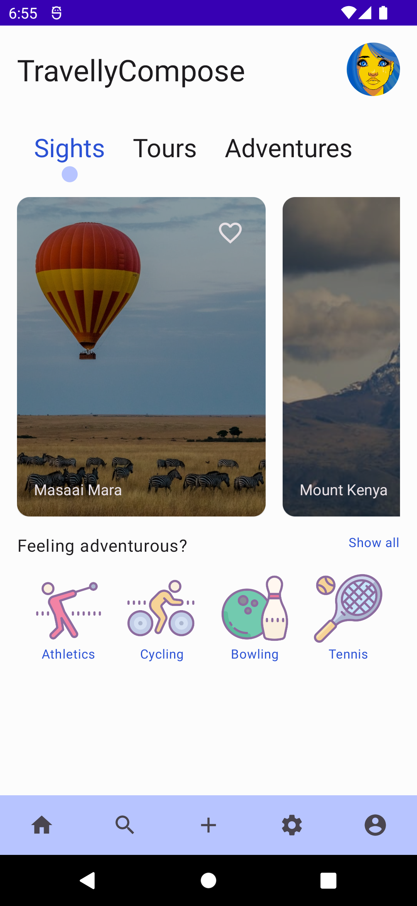
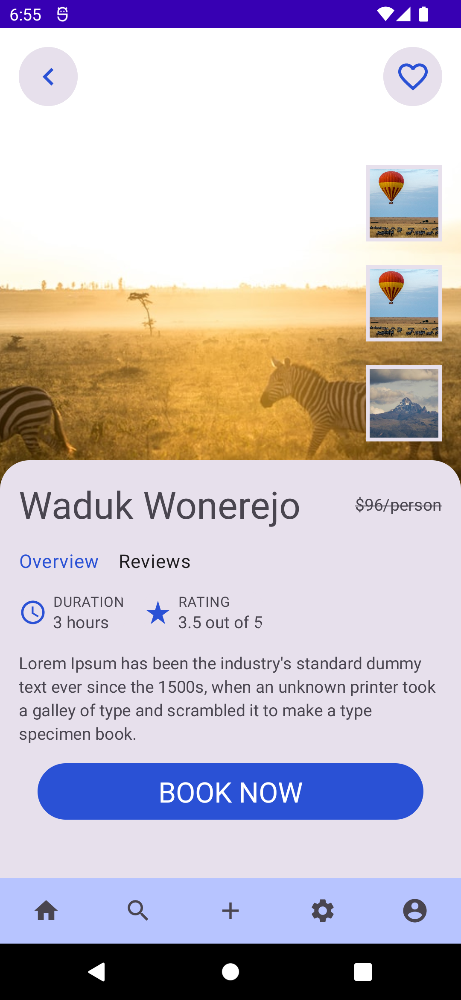
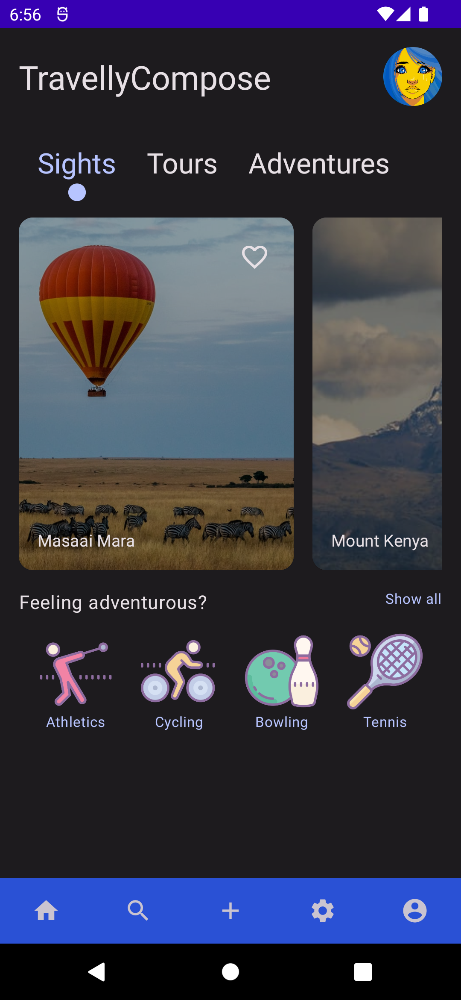
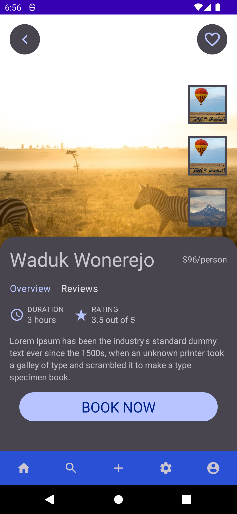

# Travelly Compose
This is a simple application using Jetpack Compose. It is just a UI no code logic added, trying to learn this compose thing.
Clone and enjoy

The application has included [Clean Architecture by Uncle Bob](https://www.oreilly.com/library/view/clean-architecture-a/9780134494272/) that guides in separation of concerns for easier testing and debugging.

## Design Motivation
The design template is motivated by [this](https://dribbble.com/shots/18106551-Travel-App) dribble file

## Tools
The application has been built using the following:

* The application has been built with the following:

    * [Kotlin](https://kotlinlang.org/)
    * [Coroutines](https://kotlinlang.org/docs/reference/coroutines-overview.html)
    * [Flow](https://kotlinlang.org/docs/reference/coroutines/flow.html)
    * [Jetpack](https://developer.android.com/jetpack)
        * [Lifecycle](https://developer.android.com/topic/libraries/architecture/lifecycle)
        * [ViewModel](https://developer.android.com/topic/libraries/architecture/viewmodel)
    * [Dagger-Hilt](https://dagger.dev/hilt/)

* Architecture
    * App Architecture - MVVM + Clean Architecture

* Tests
    * [JUnit5](https://junit.org/junit5/)

## Screenshots
Take a peek at what am working on

HOME SCREEN | DETAIL SCREEN | HOME SCREEN (DARK) | DETAIL SCREEN (DARK) | 
----------- | ----------- | ------------- | ------ | 
 |  |  |  |
